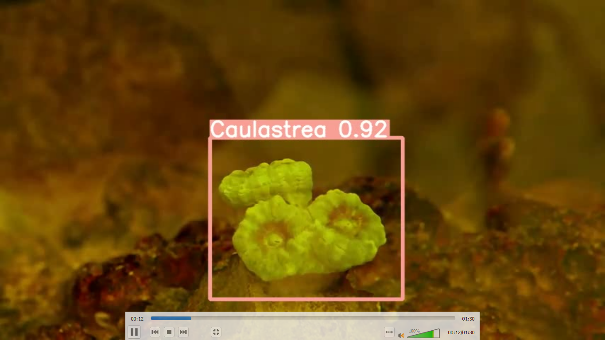

# Coral Tracking

## Classification
1. Detect 5 species of coral   
    a. Acropora Clathrata  
    b. Acropora Florida  
    c. cyphastrea Microphthalma  
    d. Diploastrea Heliopora  
    e. Pachyseris Speciosa

2. Trained with Keras-Resnet50

## Object Detection
1. Detect 3 class of coral  
    a. Acanthophyllia  
    b. Caulastrea  
    c. Cynarina  

2. Trained with YOLOv5

2. Can detect images or video
